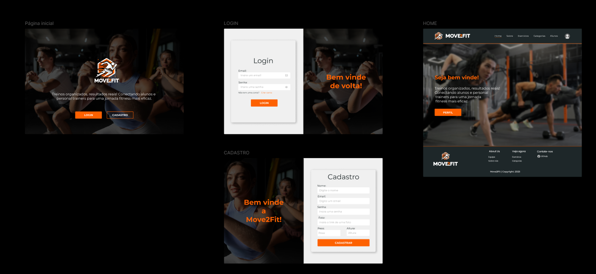

# Move2Fit - Frontend

 

    

   

## 1. Descrição

Essa aplicação foi desenvolvida com o objetivo de ajudar pessoas a se organizarem melhor e registrarem os exercícios que realizam na academia. Para isso, oferecemos um sistema completo de cadastro de exercícios, permitindo a categorização detalhada de cada atividade. Além disso, os exercícios podem ser acompanhados por informações como carga utilizada, número de repetições e tempo de execução. Dessa forma, os usuários conseguem manter um histórico preciso e estruturado, evitando que informações importantes, mas muitas vezes esquecidas por serem simples e curtas, se percam ao longo do tempo.

---

## 2. Sobre esta API

API foi criada para fazer gestão de exercícios, cargas, tempo e repetição, onde pode ser registrada essas informações, também deixando-as disponíveis para possíveis alterações e até mesmo exclusão.

### 2.1. Principais Funcionalidades

#### 1. **Gerenciamento de usuários**

- Cadastrar, atualizar e excluir usuários.
- Buscar usuários por nome, e-mail ou ID.
- Cálculo automático do IMC.
- Listar todos os usuários cadastrados

#### 2. **Gerenciamento de categorias**

- Cadastrar, atualizar e excluir categorias.
- Buscar categoria por nome ou ID.
- Listar todas as categorias cadastradas.

#### 3. **Gerenciamento de exercícios**

- Cadastrar, atualizar e excluir exercícios.
- Buscar exercício por nome ou ID.
- Listar todos os exercícios cadastrados.

---

### Diferenciais do Sistema

- **Fácil de usar**: Interface simples e intuitiva.
- **Organização total**: Tudo centralizado em um só lugar.
- **Seguro e confiável**: Desenvolvido com tecnologia moderna.

---

## 3. Layout da Aplicação

[Layout Figma](https://www.figma.com/design/ktHpttFtbqKxtrQmeS2evf/Move2Fit---Fitness?node-id=0-1&t=dQ9bMB2eq8nTaYaW-1)

    

---

## 4. Tecnologias utilizadas

| Item                          | Descrição  |
| ----------------------------- | ---------- |
| **Biblioteca**                | React      |
| **Linguagem de programação**  | TypeScript |
| **Biblioteca de Estilização** | Tailwind   |
| **Linguagem de Marcação**     | HTML       |

---

## 5. Configuração e Execução

1. Clone o repositório
2. Instale as dependências: `yarn`
3. Faça uma copia do arquivo `.env.example` para `.env`
4. Define a variável `VITE_API_URL` com **URL** do back-end
3. Execute a aplicação: `yarn dev`
